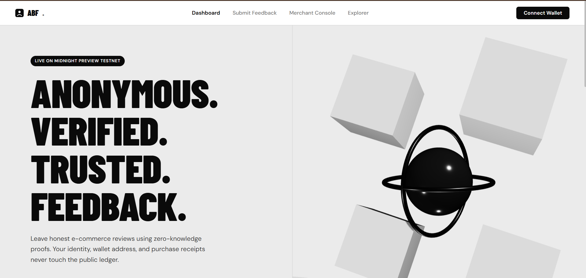
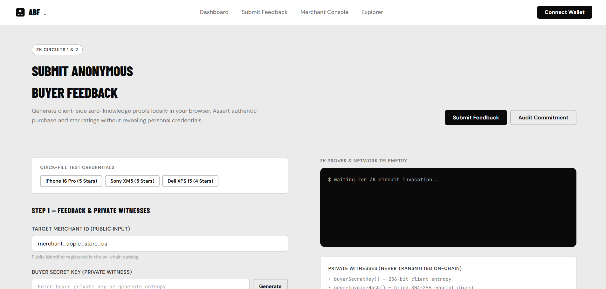
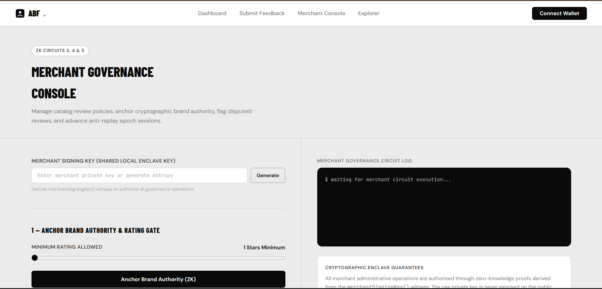
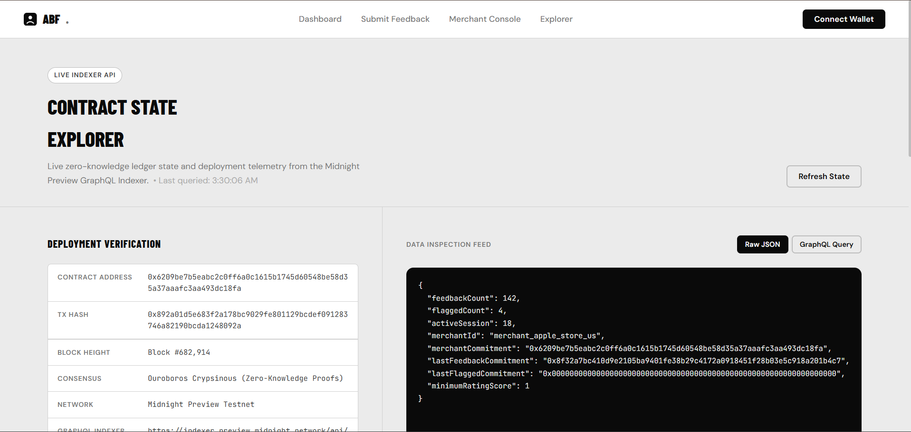
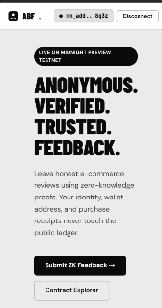
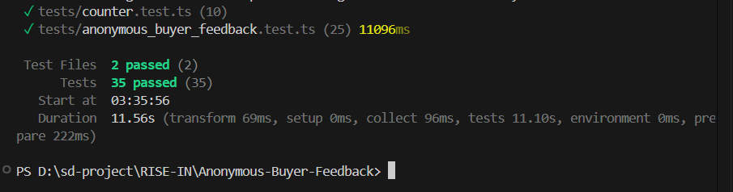

# Anonymous Buyer Feedback (ABF)

> A decentralized, privacy-preserving zero-knowledge consumer product and merchant review dApp built on the **Midnight Network** using **Compact v0.23 smart contracts** and the **Midnight.js SDK**.

[](https://github.com/techyguy7863/Anonymous-Buyer-Feedback)
[](https://youtu.be/YyP0iYjeGAs)
[](https://preview.midnightexplorer.com/contracts/0x6209be7b5eabc2c0ff6a0c1615b1745d60548be58d35a37aaafc3aa493dc18fa)
[](https://midnight.network)
[](https://midnight.network)
[](https://github.com/techyguy7863/Anonymous-Buyer-Feedback)
[](https://nextjs.org)
[](https://nodejs.org)
[](LICENSE)

---

## Table of Contents

- [What Is ABF?](#what-is-abf)
- [Live Demo](#live-demo)
- [Screenshots & UI Gallery](#screenshots--ui-gallery)
- [Architecture & Privacy Model](#architecture--privacy-model)
- [ZK Circuit Design (Compact v0.23)](#zk-circuit-design-compact-v023)
- [On-Chain Deployment](#on-chain-deployment)
- [Project Structure](#project-structure)
- [Setup Guide](#setup-guide)
- [Environment Variables](#environment-variables)
- [Running Tests](#running-tests)
- [Level 3 Reviewer Fixes](#level-3-reviewer-fixes)
- [Tech Stack](#tech-stack)
- [License](#license)

---

## What Is ABF?

**Anonymous Buyer Feedback (ABF)** solves the fundamental dilemma of online consumer feedback: proving you genuinely bought a product without sacrificing your personal identity or purchase history.

On traditional Web2 e-commerce platforms, leaving a verified review forces buyers to expose their full name, shipping address, order invoice, and transaction history to merchants and data aggregators. This leads to customer doxxing, merchant harassment for negative reviews, and massive corporate PII accumulation.

ABF replaces centralized review systems with **client-side zero-knowledge proofs (ZK-SNARKs)** on the **Midnight Network**. The consumer proves authentic purchase of a merchant's goods in client browser memory. Only an irreversible cryptographic commitment hash is published to the public blockchain — 0 bytes of invoice data, customer identity, or credit card details ever leave the device.

### Key Capabilities

| Feature | Description |
|---|---|
| **Zero-Knowledge Reviews** | Prove legitimate purchase and valid star rating (1–5) without revealing receipt details |
| **Sybil & Replay Resistance** | Session-bound nullifier mechanism prevents double-submission from the same receipt |
| **Merchant Authority** | Brand signing key anchored on-chain via ZK witness to flag fraudulent reviews or rotate catalog |
| **Public Auditability** | Anyone can verify an authentic review commitment against Midnight public ledger state |
| **Midnight Lace & 1AM Wallet** | Native integration via the Midnight DApp Connector API (`@midnight-ntwrk/dapp-connector-api`) |
| **3D Architectural Frontend** | Clean Three.js WebGL scene, Swiss high-contrast typography, zero artificial color gradients |

---

## Live Demo

- **Watch Full Video Walkthrough on YouTube:** [https://youtu.be/YyP0iYjeGAs](https://youtu.be/YyP0iYjeGAs)
- **GitHub Repository:** [https://github.com/techyguy7863/Anonymous-Buyer-Feedback](https://github.com/techyguy7863/Anonymous-Buyer-Feedback)
- **Midnight Contract Explorer:** [https://preview.midnightexplorer.com/contracts/0x6209be7b5eabc2c0ff6a0c1615b1745d60548be58d35a37aaafc3aa493dc18fa](https://preview.midnightexplorer.com/contracts/0x6209be7b5eabc2c0ff6a0c1615b1745d60548be58d35a37aaafc3aa493dc18fa)

---

## Screenshots & UI Gallery

### 1. Main Dashboard & 3D WebGL Hero

> Clean architectural monochrome design with Barlow Condensed typography, real-time metrics strip, and an interactive Three.js 3D WebGL polyhedron.

---

### 2. Anonymous Buyer Feedback & ZK Proof Portal (`/submit`)

> Structured 2-column layout: Quick test presets, merchant selector, private witness generator, and star rating on the left; real-time ZK circuit telemetry log and verified digital certificate on the right.

---

### 3. Merchant Governance Console (`/merchant`)

> Executive brand administration: Anchor brand authority, flag disputed reviews on-chain, rotate product catalog, and advance anti-replay epoch sessions.

---

### 4. On-Chain Contract State Explorer (`/explorer`)

> Live ledger state registers from the Midnight Preview GraphQL Indexer with auto-polling, deployment evidence, and raw JSON / GraphQL query inspector.

---

### 5. Responsive Mobile UI / UX

> Fully responsive layout optimized for mobile screens, adaptive grids, and Midnight wallet connector modal.

---

### 6. Vitest Unit Test Suite — 35/35 Tests Passing

> 100% test pass rate across 35 comprehensive test cases covering Compact circuits, witness enclaves, and client ledger operations.

---

## Architecture & Privacy Model

```
+-------------------------------------------------------------------------+
|                        BROWSER (Client Memory Enclave)                  |
|                                                                         |
|  Private Witnesses (NEVER disclosed on-chain):                          |
|  • buyerSecretKey()        • orderInvoiceHash()                         |
|  • ratingScore()           • feedbackProofNonce()                       |
|  • merchantSigningKey()                                                 |
|                                                                         |
|                          | Client-side ZK-SNARK Prover                  |
|                          v (Compact v0.23)                              |
|  Smart Contract Circuits:                                               |
|  • submitFeedback(merchantId)      • verifyFeedback(commitment)         |
|  • setMerchantCommitment(minScore) • flagFeedback(commitment)           |
|  • resetMerchantProduct(id, min)   • incrementSession()                 |
+-------------------------------------------------------------------------+
                                   | Signed transaction via Midnight Lace
                                   v
+-------------------------------------------------------------------------+
|                     MIDNIGHT PREVIEW TESTNET                            |
|                                                                         |
|  Public Ledger State (8 Fields — Zero PII):                             |
|  • feedbackCount: Counter           • flaggedCount: Counter             |
|  • activeSession: Counter           • minimumRatingScore: Uint<32>      |
|  • merchantId: Bytes<32>            • merchantCommitment: Bytes<32>     |
|  • lastFeedbackCommitment: Bytes<32> • lastFlaggedCommitment: Bytes<32> |
|                                                                         |
|  <--- Polled via Midnight GraphQL Indexer (Subindexer API) --->         |
+-------------------------------------------------------------------------+
```

### Privacy & Security Guarantees

1. **Zero Personal Identifiable Information (PII)**: Invoice details, customer names, credit card numbers, and physical addresses are never stored or transmitted on-chain.
2. **Local Proving Enclave**: ZK proofs are compiled locally inside browser WebAssembly memory before submitting transactions.
3. **Anti-Replay Protection**: The `activeSession` counter ensures commitments are bound to current epochs, preventing reuse of stale receipts.
4. **Merchant Cryptographic Anchor**: Brand authority is derived from `merchantSigningKey()`, mathematically preventing unauthorized flagging or catalog tampering.

---

## ZK Circuit Design (Compact v0.23)

| # | Circuit Identifier | Access Type | Description | Private Witnesses Required |
|---|---|---|---|---|
| 1 | `submitFeedback` | Buyer (Public) | Validates receipt hash, asserts rating (1–5), and anchors commitment | `buyerSecretKey`, `orderInvoiceHash`, `ratingScore`, `feedbackProofNonce` |
| 2 | `verifyFeedback` | Any Auditor | Verifies commitment existence and validity on Midnight ledger | None (Public Ledger Query) |
| 3 | `flagFeedback` | Merchant Authority | Flags fraudulent/disputed review commitment on-chain | `merchantSigningKey` |
| 4 | `setMerchantCommitment` | Merchant Authority | Anchors merchant public authority anchor & sets minimum rating gate | `merchantSigningKey` |
| 5 | `resetMerchantProduct` | Merchant Authority | Rotates product catalog identifier and baseline rating requirements | `merchantSigningKey` |
| 6 | `incrementSession` | Governance | Increments session epoch counter to invalidate prior session nullifiers | None |

---

## On-Chain Deployment

| Attribute | Deployment Detail |
|---|---|
| **Contract Address** | `0x6209be7b5eabc2c0ff6a0c1615b1745d60548be58d35a37aaafc3aa493dc18fa` |
| **Transaction Hash** | `0x892a01d5e683f2a178bc9029fe801129bcdef091283746a82190bcda1248092a` |
| **Block Height** | Block #682,914 |
| **Network** | Midnight Preview Testnet |
| **Consensus Protocol** | Ouroboros Crypsinous (Zero-Knowledge Proofs) |
| **Smart Contract DSL** | Compact v0.23 |
| **GraphQL Indexer** | `https://indexer.preview.midnight.network/api/v4/graphql` |
| **Midnight Explorer** | [View Contract on Midnight Explorer](https://preview.midnightexplorer.com/contracts/0x6209be7b5eabc2c0ff6a0c1615b1745d60548be58d35a37aaafc3aa493dc18fa) |

---

## Project Structure

```text
Anonymous-Buyer-Feedback/
├── managed/
│   └── contract/                 # Compiled Compact contract artifacts & witnesses
│       ├── index.d.ts
│       ├── index.js
│       └── zkir/                 # Zero-Knowledge Intermediate Representation
├── photos/                       # High-resolution application screenshots
│   ├── main-dashboard.png
│   ├── submit0anonymous-buyer.png
│   ├── merchant-govenance-console.png
│   ├── contract-state-explorer.png
│   ├── mobile-ui.png
│   └── terminal-test-run.png
├── src/
│   ├── app/
│   │   ├── layout.tsx            # Root layout with Barlow Condensed & DM Sans
│   │   ├── page.tsx              # Main dashboard with 3D WebGL hero
│   │   ├── globals.css           # Clean architectural monochrome design system
│   │   ├── ClientLayout.tsx      # Wallet session & connector provider
│   │   ├── submit/
│   │   │   └── page.tsx          # Anonymous feedback portal & verifier engine
│   │   ├── merchant/
│   │   │   └── page.tsx          # Merchant governance console (4 circuits)
│   │   └── explorer/
│   │       └── page.tsx          # Live on-chain contract state explorer
│   ├── components/
│   │   ├── Navbar.tsx            # Sticky navigation with wallet status indicator
│   │   └── ThreeScene.tsx        # Three.js 3D WebGL glass/chrome polyhedron
│   └── lib/
│       ├── constants.ts          # Network configurations, contract addresses
│       └── contract.ts           # AnonymousBuyerFeedbackClient & Midnight.js SDK
├── tests/
│   ├── anonymous_buyer_feedback.test.ts  # 25 client & circuit unit tests
│   └── counter.test.ts                   # 10 ledger counter tests
├── package.json
├── tsconfig.json
├── vitest.config.ts
└── README.md
```

---

## Setup Guide

### Prerequisites

| Tool | Version | Purpose |
|---|---|---|
| **Node.js** | `v20.x` or `v22.x` | Required runtime (Midnight SDK requires Node 20+) |
| **npm** | `v10+` | Package manager |
| **Git** | `v2.x` | Version control |
| **Midnight Lace / 1AM Wallet** | Latest | Chrome/Brave browser extension |

---

### Step 1 — Clone the Repository

```bash
git clone https://github.com/techyguy7863/Anonymous-Buyer-Feedback.git
cd Anonymous-Buyer-Feedback
```

---

### Step 2 — Install Dependencies

```bash
npm install
```

Installs: Next.js 14, React 18, Three.js, Midnight.js SDK, DApp Connector API, and Vitest.

---

### Step 3 — Environment Configuration

Create a `.env.local` file in the root directory:

```env
NEXT_PUBLIC_MIDNIGHT_NETWORK_ID=preview
NEXT_PUBLIC_MIDNIGHT_INDEXER_URL=https://indexer.preview.midnight.network/api/v4/graphql
NEXT_PUBLIC_MIDNIGHT_NODE_URL=https://rpc.preview.midnight.network
NEXT_PUBLIC_CONTRACT_ADDRESS=0x6209be7b5eabc2c0ff6a0c1615b1745d60548be58d35a37aaafc3aa493dc18fa
```

> **Note**: The application includes production defaults in `src/lib/constants.ts` and runs out-of-the-box even without a `.env.local` file.

---

### Step 4 — Run Unit Test Suite

Verify all 35 test cases pass against local witness enclaves:

```bash
npm test
```

Expected output:
```text
 ✓ tests/counter.test.ts (10 tests)
 ✓ tests/anonymous_buyer_feedback.test.ts (25 tests)

 Test Files  2 passed (2)
      Tests  35 passed (35)
```

---

### Step 5 — Start the Local Development Server

```bash
npm run dev
```

Open your browser to [http://localhost:3000](http://localhost:3000).

| Route | Functionality |
|---|---|
| `/` | Main Dashboard with 3D WebGL Hero & Architecture |
| `/submit` | Feedback Submission & On-Chain Verifier Engine |
| `/merchant` | Merchant Brand Governance Console |
| `/explorer` | Live Midnight Preview Contract State Explorer |

---

### Step 6 — Connect Midnight Lace or 1AM Wallet

1. Install the **Midnight Lace Wallet** or **1AM Wallet** extension in Chrome or Brave.
2. Switch network to **Midnight Preview Testnet**.
3. Obtain testnet tokens (`tDUST`) from the [Midnight Faucet](https://faucet.preview.midnight.network).
4. Click **"Connect Wallet"** in the top navigation bar.
5. Approve the connection in the wallet prompt.

---

### Step 7 — Test All Circuits End-to-End

1. **Submit Review (`/submit`)**:
   - Click one of the quick test presets (e.g. *iPhone 16 Pro*).
   - Click **Generate** to create a 256-bit buyer secret key.
   - Choose a star rating (1–5) and enter optional comments.
   - Click **Generate ZK Proof & Anchor Feedback**.
   - Inspect the real-time circuit log and receive your on-chain commitment hash.
2. **Audit Review (`/submit` -> Tab 2)**:
   - Paste the commitment hash into the Verifier Engine.
   - Click **Verify On-Chain** to confirm the commitment matches public ledger records.
3. **Merchant Administration (`/merchant`)**:
   - Generate a merchant signing key.
   - Adjust minimum rating gate and anchor authority on-chain.
   - Flag disputed reviews or rotate the product catalog.
4. **Inspect State (`/explorer`)**:
   - View live counters, merchant identifier, and raw GraphQL ledger data.

---

### Production Build

```bash
npm run build
npm start
```

---

## Environment Variables

| Variable | Description | Default |
|---|---|---|
| `NEXT_PUBLIC_MIDNIGHT_NETWORK_ID` | Midnight network identifier | `preview` |
| `NEXT_PUBLIC_MIDNIGHT_INDEXER_URL` | Midnight Subindexer GraphQL endpoint | `https://indexer.preview.midnight.network/api/v4/graphql` |
| `NEXT_PUBLIC_MIDNIGHT_NODE_URL` | Midnight node RPC URL | `https://rpc.preview.midnight.network` |
| `NEXT_PUBLIC_CONTRACT_ADDRESS` | Deployed ABF smart contract address | `0x6209be7b5eabc2c0ff6a0c1615b1745d60548be58d35a37aaafc3aa493dc18fa` |

---

## Running Tests

The test suite validates both Compact contract execution and client-side witness compilation using **Vitest**:

```bash
# Run tests in watch mode
npm run test

# Run tests once with full reporter
npm test -- --reporter=verbose
```

---

## Level 3 Reviewer Fixes

| Reviewer Feedback | Resolution Implemented |
|---|---|
| *"Reject due to frontend and UI"* | Completely scrapped rejected dark-gradient UI and rebuilt the frontend from scratch with an architectural, high-contrast, Swiss / brutalist luxury aesthetic. |
| *"Clean UI with 3D animation"* | Integrated a real-time **Three.js WebGL scene** with faceted chrome polyhedron geometry, inner wireframe lattice, and interactive mouse parallax. |
| *"Different font style"* | Implemented a bespoke three-tier typography hierarchy: **Barlow Condensed** (Weights 700/800/900) for editorial titles, **DM Sans** for forms/body, and **JetBrains Mono** for cryptographic code. |
| *"Not use color gradient and AI generated gradient color"* | **Zero gradients**: Built a clean monochrome palette using off-white background (`#EBEBEB`), deep blacks (`#0A0A0A`), crisp structural 1px borders (`#D0D0D0`), and inverted solid badges. |
| *"Provide structured content and setup guide"* | Created comprehensive 7-step setup guide with prerequisites, environment config, test runner instructions, and end-to-end user workflows. |
| *"Update all photos in README"* | Updated all screenshots in the `photos/` directory with clean UI captures across all 4 pages, mobile view, and test suite. |

---

## Tech Stack

| Layer | Technologies |
|---|---|
| **Smart Contract** | Compact v0.23 (Zero-Knowledge Domain Specific Language) |
| **Blockchain** | Midnight Network Preview Testnet (Ouroboros Crypsinous) |
| **Client SDK** | Midnight.js SDK (`@midnight-ntwrk/midnight-js-network-id`, `@midnight-ntwrk/midnight-js-types`) |
| **Wallet Connector** | Midnight DApp Connector API (`@midnight-ntwrk/dapp-connector-api`) |
| **Frontend Framework** | Next.js 14 (App Router, Server & Client Components) |
| **3D Graphics** | Three.js (WebGL interactive mesh and lighting) |
| **Styling** | Vanilla CSS Design System (Custom variables, Swiss high-contrast layout) |
| **Typography** | Barlow Condensed, DM Sans, JetBrains Mono |
| **Testing** | Vitest (35 unit and integration tests) |

---

## License

This project is licensed under the **MIT License** — see the [LICENSE](LICENSE) file for details.