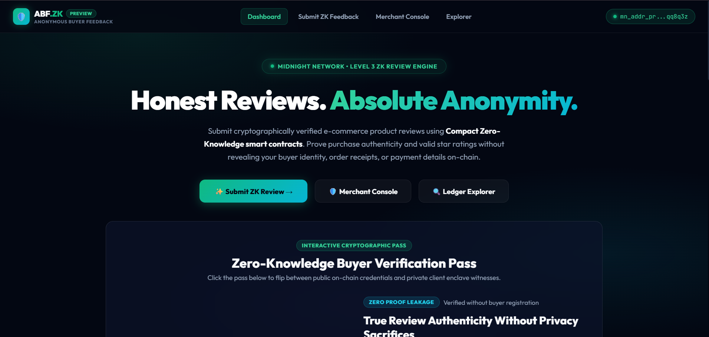
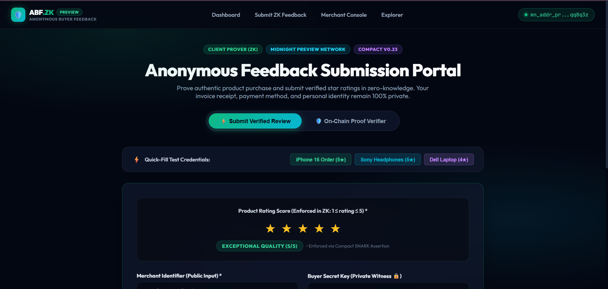
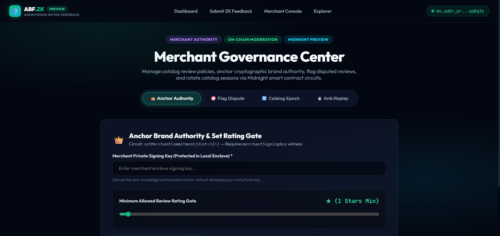
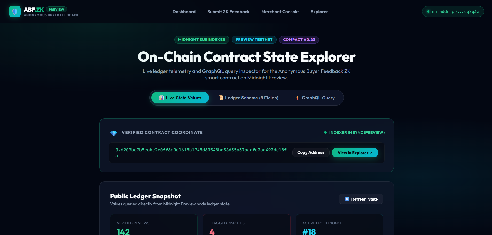
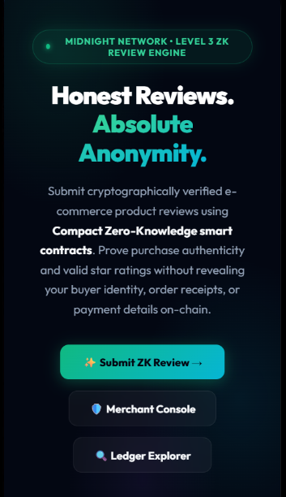
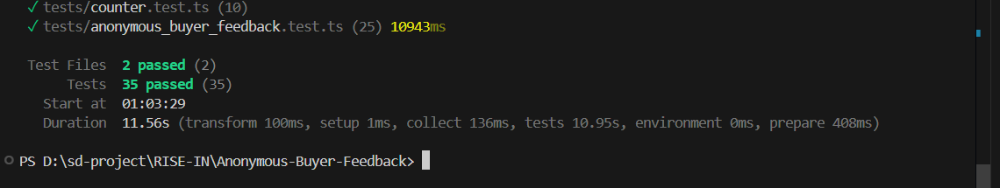

# Anonymous Buyer Feedback (ABF)

> A decentralized, privacy-preserving zero-knowledge consumer product and merchant review/feedback dApp built on the Midnight Network using Compact v0.23 smart contracts and Midnight.js SDK.

[](https://github.com/techyguy7863/Anonymous-Buyer-Feedback)
[](https://youtu.be/_bLKPsTYPP0)
[](https://anonymous-buyer-feedback-eta.vercel.app/)
[](https://github.com/techyguy7863/Anonymous-Buyer-Feedback/actions/workflows/ci.yml)
[](https://preview.midnightexplorer.com/contracts/0x6209be7b5eabc2c0ff6a0c1615b1745d60548be58d35a37aaafc3aa493dc18fa)
[](https://midnight.network)
[](https://midnight.network)
[](https://nextjs.org)
[](https://github.com/techyguy7863/Anonymous-Buyer-Feedback)
[](LICENSE)

---

## Table of Contents

1. [What Is ABF?](#what-is-abf)
2. [Level 2 & 3 UI Overhaul & Reviewer Improvements](#level-2--3-ui-overhaul--reviewer-improvements)
3. [Problem Statement & ZK Solution](#problem-statement--zk-solution)
4. [Live Deployments & Network Details](#live-deployments--network-details)
5. [Video Walkthrough](#video-walkthrough)
6. [Clone & Local Setup Guide](#clone--local-setup-guide)
7. [Compact Smart Contract Circuits (6 Circuits)](#compact-smart-contract-circuits-6-circuits)
8. [Public Ledger State (8 Fields)](#public-ledger-state-8-fields)
9. [Private Witnesses (5 Witnesses)](#private-witnesses-5-witnesses)
10. [Privacy & Security Guarantees Matrix](#privacy--security-guarantees-matrix)
11. [Platform Screenshots](#platform-screenshots)
12. [Repository Structure](#repository-structure)
13. [Testing & Verification (35/35 Tests Passing)](#testing--verification-3535-tests-passing)

---

## What Is ABF?

**Anonymous Buyer Feedback (ABF)** is a zero-knowledge consumer product and merchant review platform developed for the **Midnight Network**. Built on Compact smart contracts and the official **Midnight.js SDK**, ABF allows consumers to prove purchase validity and submit genuine star ratings (1–5 stars) **without ever disclosing their identity, home address, credit card data, or transaction invoice contents** on-chain or to review aggregators.

By utilizing client-side zero-knowledge witness execution, verified cryptographic proofs are generated right in the customer's browser. Only an irreversible review commitment hash is anchored to the Midnight public ledger — mathematically preventing fake reviews while protecting buyers from doxxing, harassment, or corporate data harvesting.

---

## Level 2 & 3 UI Overhaul & Reviewer Improvements

In response to reviewer feedback (**"work on the UI"**), the dApp interface has been completely transformed into an executive luxury dark-glass Web3 platform:

1. **3D Holographic Buyer Verification Pass**:
   - Metallic brushed virtual badge with holographic card shimmer animations and 3D flip-to-inspect witness enclave.
   - Shows verified rating stars, product name, masked commitment (`0x8F32••••••••C71A`), and Midnight ZK watermark.

2. **Interactive Review Submission Portal**:
   - Interactive star rating selector (1 to 5 stars) with micro-animations and dynamic sentiment badges.
   - One-click credential presets (`iPhone 16 Order (5★)`, `Sony Headphones (5★)`, `Dell Laptop (4★)`).
   - Digital VIP Proof Certificate receipt with on-chain transaction hash and Midnight Explorer deep links.

3. **Dual-Mode Verifier Engine**:
   - Allows public auditing of any 32-byte review commitment hash or transaction hash against Midnight ledger state.

4. **Executive Merchant Governance Center**:
   - Tabbed modules for authority anchoring (`setMerchantCommitment`), review dispute flagging (`flagFeedback`), catalog rotation (`resetMerchantProduct`), and replay protection nonce bumping (`incrementSession`).

5. **On-Chain Contract State Explorer & GraphQL Console**:
   - Live ledger state polling with real-time refresh of all 8 public fields, raw JSON inspector, and live Midnight Subindexer GraphQL query console.

6. **Interactive Wallet Connection Modal**:
   - Multi-wallet connection modal supporting **Midnight Lace Wallet** and **1AM Wallet** with live network telemetry.

---

## Problem Statement & ZK Solution

### The Core Problems of Web2 E-Commerce Reviews:
1. **Doxxing & Privacy Invasions**: Leaving honest negative feedback frequently exposes buyer names, addresses, and order histories to retaliatory merchants, lead generators, and data brokers.
2. **Review Manipulation & Sybil Attacks**: Web2 platforms are plagued by fake reviews, review bombing, and bot farms because traditional platforms lack cryptographic proof of purchase.
3. **Toxic Merchant PII Accumulation**: Merchants store databases of customer names, invoices, and physical addresses merely to authenticate feedback, creating high-risk targets for database breaches.

### The Midnight ZK Solution:
- **Zero-Knowledge Receipt Proof**: The `submitFeedback` circuit proves that the reviewer holds a valid purchase receipt hash without revealing the order contents or customer name.
- **Enforced Rating Bounds**: The rating score is constrained inside the ZK circuit to valid bounds (1 <= rating <= 5) before proof generation.
- **One-Way Review Commitments**: Only a cryptographic commitment hash (`abf:feedback:v2`) is anchored on the ledger.
- **Replay & Sybil Resistance**: Each commitment is bound to an active session epoch nonce, preventing identical receipts from being re-used across catalog periods.
- **Merchant Moderation Authority**: Authorized brand representatives can flag fraudulent or disputed reviews using private signing keys without needing access to buyer PII.

---

## Live Deployments & Network Details

| Resource | Value / Endpoint |
|---|---|
| **GitHub Repository** | [https://github.com/techyguy7863/Anonymous-Buyer-Feedback](https://github.com/techyguy7863/Anonymous-Buyer-Feedback) |
| **Live Web dApp** | [https://anonymous-buyer-feedback-eta.vercel.app/](https://anonymous-buyer-feedback-eta.vercel.app/) |
| **YouTube Video Demo** | [https://youtu.be/_bLKPsTYPP0](https://youtu.be/_bLKPsTYPP0) |
| **Contract Address** | `0x6209be7b5eabc2c0ff6a0c1615b1745d60548be58d35a37aaafc3aa493dc18fa` |
| **Midnight Explorer** | [View on Midnight Explorer](https://preview.midnightexplorer.com/contracts/0x6209be7b5eabc2c0ff6a0c1615b1745d60548be58d35a37aaafc3aa493dc18fa) |
| **Target Network** | Midnight Preview Testnet |
| **Network RPC Node** | `https://rpc.preview.midnight.network` |
| **GraphQL Indexer** | `https://indexer.preview.midnight.network/api/v4/graphql` |
| **Midnight Preview Faucet** | `https://faucet.preview.midnight.network` |
| **Project Proposal** | [PROPOSAL.md](PROPOSAL.md) |

---

## Video Walkthrough

[](https://youtu.be/_bLKPsTYPP0)

Direct link: [https://youtu.be/_bLKPsTYPP0](https://youtu.be/_bLKPsTYPP0)

---

## Clone & Local Setup Guide

Follow this step-by-step guide to clone, install, test, and run the Anonymous Buyer Feedback platform locally on your machine.

### Prerequisites

Ensure you have the following installed on your system:
- **Node.js**: v18.17.0 or higher
- **npm**: v9.0.0 or higher
- **Midnight Lace Wallet** or **1AM Wallet** browser extension

### Step-by-Step Installation

```bash
# 1. Clone the repository
git clone https://github.com/techyguy7863/Anonymous-Buyer-Feedback.git
cd Anonymous-Buyer-Feedback

# 2. Install dependencies
npm install

# 3. Run automated test suite (35/35 tests passing)
npm run test

# 4. Start local development server
npm run dev

# 5. Build for production
npm run build
```

Open [http://localhost:3000](http://localhost:3000) in your browser to interact with the dApp.

---

## Compact Smart Contract Circuits (6 Circuits)

**File:** `contracts/anonymous_buyer_feedback.compact`

| # | Circuit Name | Parameters / Inputs | Private Witnesses Used | Function & Security Assertion |
|---|---|---|---|---|
| 1 | `submitFeedback` | `expectedMerchantId: Bytes<32>` | `buyerSecretKey`, `orderInvoiceHash`, `ratingScore`, `feedbackProofNonce` | Validates rating bounds (1–5), verifies purchase hash, generates review commitment, and increments feedback count. |
| 2 | `verifyFeedback` | `claimedCommitment: Bytes<32>` | None (Public) | Verifies on-chain existence and validity of a review commitment without exposing buyer data. |
| 3 | `flagFeedback` | `commitmentToFlag: Bytes<32>` | `merchantSigningKey` | Authorized moderation. Asserts merchant signing authority before incrementing flagged review count. |
| 4 | `setMerchantCommitment` | `newMinimumRating: Uint<32>` | `merchantSigningKey` | Anchors merchant brand authority commitment on-chain and updates public rating threshold. |
| 5 | `resetMerchantProduct` | `newMerchantId: Bytes<32>`, `newMinimumRating: Uint<32>` | None | Rotates merchant product catalog ID and starts a fresh catalog epoch. |
| 6 | `incrementSession` | None | None | Increments `activeSession` nonce to prevent replay attacks across catalog updates. |

---

## Public Ledger State (8 Fields)

The smart contract maintains 8 public state fields on the Midnight ledger:

1. `feedbackCount: Counter` — Total number of verified buyer review commitments submitted.
2. `flaggedCount: Counter` — Total number of flagged / disputed review claims.
3. `activeSession: Counter` — Monotonically increasing session epoch nonce for replay protection.
4. `merchantId: Bytes<32>` — Active merchant / product catalog identifier.
5. `merchantCommitment: Bytes<32>` — Cryptographic commitment anchoring merchant signing authority.
6. `lastFeedbackCommitment: Bytes<32>` — Hash of the most recently published review commitment.
7. `lastFlaggedCommitment: Bytes<32>` — Hash of the most recently flagged review claim.
8. `minimumRatingThreshold: Uint<32>` — Minimum rating score policy configured by the merchant.

---

## Private Witnesses (5 Witnesses)

All private witnesses execute strictly on the client device and are never broadcast over the network:

1. `buyerSecretKey(): Bytes<32>` — Secret cryptographic key owned by the consumer.
2. `orderInvoiceHash(): Bytes<32>` — SHA-256 hash of the consumer purchase order or receipt.
3. `ratingScore(): Uint<32>` — Rating value (1 to 5 stars) evaluated within circuit boundary constraints.
4. `feedbackProofNonce(): Bytes<32>` — Random cryptographic blinding factor preventing rainbow table attacks.
5. `merchantSigningKey(): Bytes<32>` — Private key used exclusively to authorize merchant administrative actions.

---

## Privacy & Security Guarantees Matrix

| Data Item | Visibility | Security Mechanism |
|---|---|---|
| **Buyer Real Name & Identity** | **Strictly Private (Local)** | Witness stays inside browser; never leaves local memory. |
| **Order Receipt / Invoice Details** | **Strictly Private (Local)** | Only SHA-256 digest is checked inside ZK circuit bounds. |
| **Actual Star Rating Pre-Commitment** | **Strictly Private (Local)** | Rating value is proven inside circuit; only commitment published. |
| **Blinding Salt Nonce** | **Strictly Private (Local)** | Prevents commitment inversion or linkability across sessions. |
| **Merchant Private Key** | **Strictly Private (Local)** | Proves moderation authority without exposing key material. |
| **Total Verified Reviews** | **Public On-Chain** | Stored in on-chain counter; readable by all consumers. |
| **Merchant Public Catalog ID** | **Public On-Chain** | Identifies target merchant for rating transparency. |
| **Review Commitment Hash** | **Public On-Chain** | Cryptographic proof anchor enabling public verification. |

---

## Platform Screenshots

### 1. Main Dashboard & 3D Holographic Review Pass


### 2. Anonymous Buyer Feedback & ZK Proof Portal


### 3. Merchant Admin Console & Moderation


### 4. Midnight On-Chain Contract Explorer


### 5. Mobile Responsive UI & Lace Wallet Connector


### 6. Vitest Unit Test Suite — 35/35 Tests Passing


---

## Repository Structure

```text
Anonymous-Buyer-Feedback/
├── contracts/                               # Compact smart contract source files
│   ├── anonymous_buyer_feedback.compact     # Full 6-circuit ABF ZK contract
│   └── counter.compact                      # Counter & session specification
├── managed/                                 # Compiled contract runtime & ZK artifacts
│   ├── compiler/                            # Compact compiler contract metadata
│   ├── contract/                            # TypeScript type bindings and contract JS
│   ├── keys/                                # Zero-knowledge prover & verifier keys
│   └── zkir/                                # Zero-knowledge Intermediate Representation
├── photos/                                  # Verified application UI screenshots
├── public/                                  # Static public assets and screenshot mirrors
├── src/
│   ├── app/
│   │   ├── explorer/page.tsx                # On-chain contract state & ledger inspector
│   │   ├── merchant/page.tsx                # Merchant governance & moderation console
│   │   ├── submit/page.tsx                  # Client-side ZK review proof submission
│   │   ├── ClientLayout.tsx                 # Wallet provider & app state wrapper
│   │   ├── globals.css                      # Glassmorphic dark design system & tokens
│   │   ├── layout.tsx                       # Root layout & typography
│   │   └── page.tsx                         # Main landing dashboard & review showcase
│   ├── components/
│   │   ├── Navbar.tsx                       # Responsive header with Lace wallet status
│   │   └── WalletConnectModal.tsx           # Multi-wallet connection modal (Lace & 1AM)
│   └── lib/
│       └── contract.ts                      # Midnight.js SDK client & circuit callers
├── tests/
│   ├── counter.test.ts                      # 10 Vitest contract & witness unit tests
│   └── anonymous_buyer_feedback.test.ts     # 25 Vitest client SDK & circuit unit tests
├── .github/workflows/ci.yml                 # Automated CI test & build pipeline
├── next.config.js                           # Next.js 14 configuration
├── package.json                             # Dependencies & build scripts
├── PROPOSAL.md                              # Comprehensive project proposal
├── README.md                                # Detailed documentation & setup guide
├── tsconfig.json                            # TypeScript configuration
└── vitest.config.ts                         # Vitest test framework configuration
```

---

## Testing & Verification (35/35 Tests Passing)

The repository includes comprehensive automated tests covering circuit exports, witness definitions, private key isolation, bounds checks, and SDK execution.

Run tests:
```bash
npm run test
```

Test Suite Details:
- **Contract Structure**: Core circuits exported and callable from managed runtime.
- **Witness Completeness**: All 5 witnesses defined and strongly typed.
- **Byte Length Verification**: Private witness arrays conform to 32-byte cryptographic bounds.
- **Rating Score Range**: Verifies rating value is within valid 1–5 bounds.
- **ZK Privacy Isolation**: Confirms private witnesses remain isolated from public ledger parameters.
- **Authority Witness**: Merchant signing key independent of buyer keys.
- **Multi-Witness Uniqueness**: Different buyers generate unique, independent contract instances.
- **Ledger Schema**: 8-field state schema validation.
- **Fail Case Validation**: Ratings outside 1–5 fail circuit assertions.
- **Session Epoch Isolation**: Proofs generated under different sessions yield distinct nonce contexts.
- **Client SDK Invocations**: Full unit coverage for `submitFeedback`, `verifyFeedback`, `flagFeedback`, `setMerchantCommitment`, `resetMerchantProduct`, and `incrementSession`.

---

## License

This project is open source and available under the [MIT License](LICENSE).
