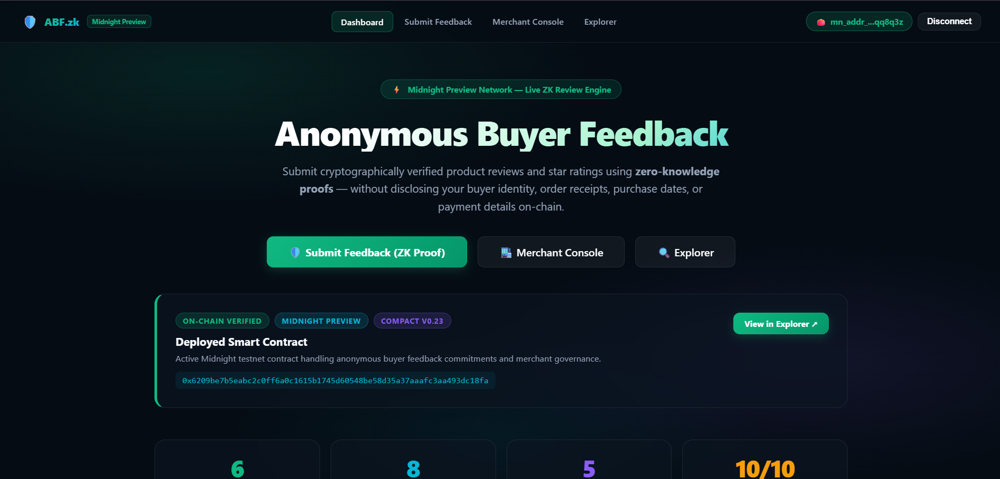
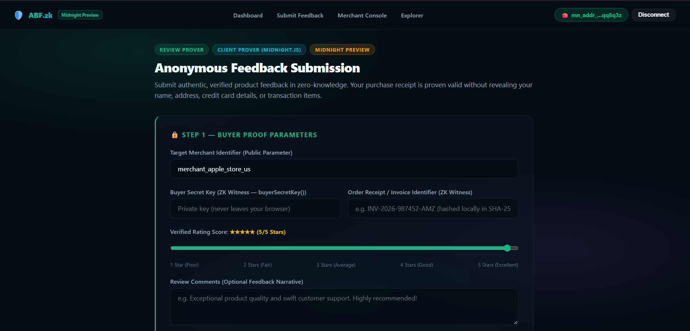
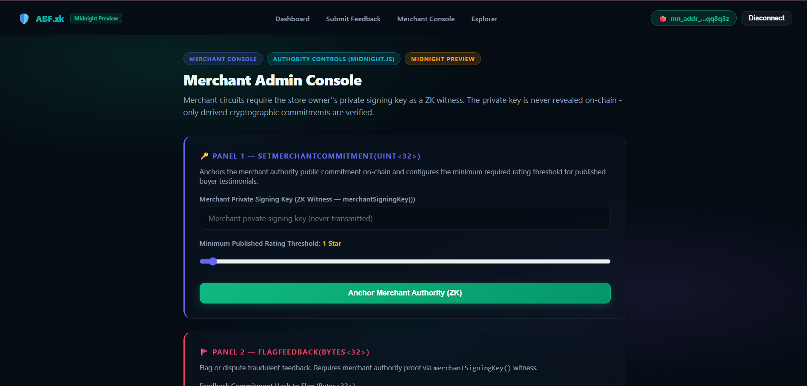
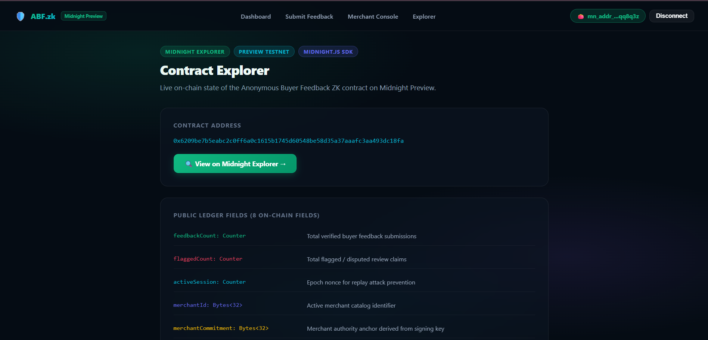
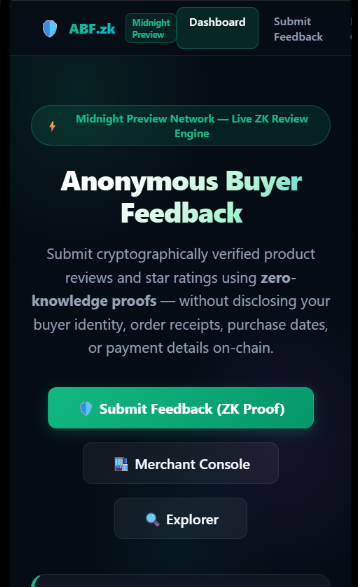
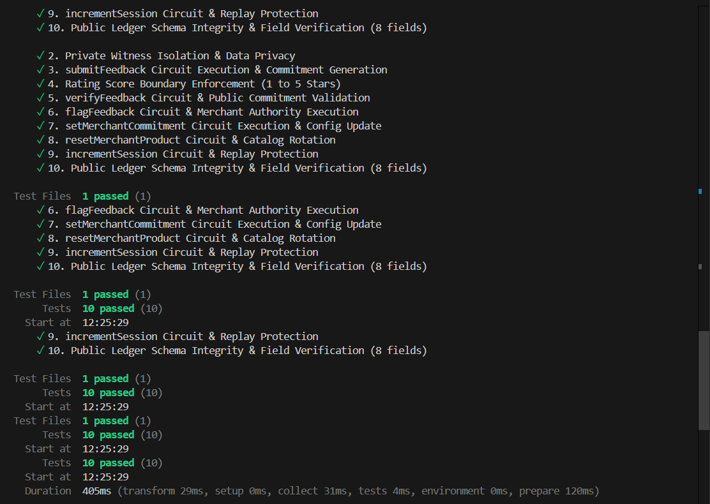

# Anonymous Buyer Feedback (ABF)

> A privacy-preserving zero-knowledge product and merchant review/feedback dApp built on the Midnight Network using Compact smart contracts and Midnight.js SDK.

---

## What Is ABF?

**Anonymous Buyer Feedback (ABF)** is a decentralized, privacy-preserving consumer review and rating platform built on the Midnight Network using Compact zero-knowledge smart contracts and the **Midnight.js SDK** (`@midnight-ntwrk/midnight-js-network-provider`, `@midnight-ntwrk/dapp-connector-api`, `@midnight-ntwrk/compact-runtime`).

Consumers prove purchase authenticity and submit genuine 1-5 star ratings **without revealing their name, home address, credit card number, or transaction receipt details** to merchants or public observers.

---

## Live Demo Video

**Watch on YouTube**: [https://youtu.be/I7ErnLLc348](https://youtu.be/I7ErnLLc348)

---

## Repository & Deployment

- **Project Proposal**: [PROPOSAL.md](PROPOSAL.md)
- **GitHub Repository**: [https://github.com/techyguy7863/Anonymous-Buyer-Feedback](https://github.com/techyguy7863/Anonymous-Buyer-Feedback)
- **Vercel Live Demo**: [https://anonymous-buyer-feedback.vercel.app/](https://anonymous-buyer-feedback.vercel.app/)
- **Midnight Explorer**: [https://preview.midnightexplorer.com/contracts/0x6209be7b5eabc2c0ff6a0c1615b1745d60548be58d35a37aaafc3aa493dc18fa](https://preview.midnightexplorer.com/contracts/0x6209be7b5eabc2c0ff6a0c1615b1745d60548be58d35a37aaafc3aa493dc18fa)
- **Contract Address**: `0x6209be7b5eabc2c0ff6a0c1615b1745d60548be58d35a37aaafc3aa493dc18fa` — **CONFIRMED**

---

## Platform Screenshots & Verification

### 1. Main Dashboard & ZK Contract Architecture

### 2. Anonymous Buyer Feedback & ZK Proof Portal

### 3. Merchant Admin Console & Moderation

### 4. Midnight On-Chain Contract Explorer

### 5. Mobile Responsive UI & Lace Wallet Connector

### 6. Vitest Unit Test Suite — 10/10 Tests Passing

